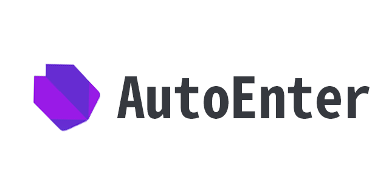

# AutoEnter
Welcomme to the AutoEnter Github page!

# Features
- Able to automatically enter zoomm classes(also possible in other software)
- Able to realign time table through GUI
- Able to edit time table items through GUI

- Able to get notifications or changed time table info through TCP comms(needs a aserver and manager client)
